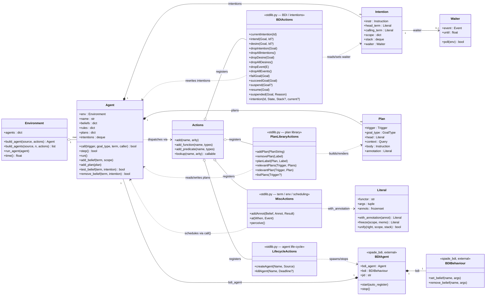

# AgentSpeak core & implemented `stdlib.py` actions

Scope: the interpreter classes in `agentspeak/__init__.py` and `agentspeak/runtime.py` that the standard-library actions actually touch, plus every internal action implemented this project (`#Enric` in `stdlib.py`), grouped the same way the project's own function table groups them. Pre-existing baseline actions (`.print`, `.findall`, `.wait`, …) are omitted — this is a map of what was *built*, not the whole stdlib.

**Color key** — grey boxes are the interpreter's own runtime classes (unmodified); the external `spade_bdi` layer is warm brown; the four implemented-action groups are blue (BDI/intentions), ochre (plan library), plum (agent life-cycle), teal (term/environment/scheduling). Dashed arrows show which runtime state each group actually reads or mutates.

## Reference: exact signatures

| Group | Action | Arity | Notes |
|---|---|---|---|
| BDI | `.current_intention(Id)` | 1 | binds the running intention |
| BDI | `.intend(Goal, Id?)` | 1–2 | test/enumerate intended goals |
| BDI | `.desire(Goal, Id?)` | 1–2 | alias of `.intend` (no event queue) |
| BDI | `.drop_intention(Goal)` | 1 | |
| BDI | `.drop_all_intentions()` | 0 | |
| BDI | `.drop_desire(Goal)` | 1 | alias of `.drop_intention` |
| BDI | `.drop_all_desires()` | 0 | alias of `.drop_all_intentions` |
| BDI | `.drop_event(E)` / `.drop_all_events()` | 1 / 0 | well-defined no-ops |
| BDI | `.fail_goal(Goal)` | 1 | redirects to failure branch or drops |
| BDI | `.succeed_goal(Goal)` | 1 | pops + back-unifies like natural completion |
| BDI | `.suspend(Goal?)` | 0–1 | reuses `Intention.waiter` |
| BDI | `.resume(Goal)` | 1 | clears only `.suspend`-tagged waiters |
| BDI | `.suspended(Goal, Reason)` | 2 | test predicate |
| BDI | `.intention(Id, State, Stack?, current?)` | 2–4 | backtracks over `agent.intentions` |
| Plan library | `.add_plan(PlanString)` | 1 | via `_tell_how` |
| Plan library | `.remove_plan(Label)` | 1 | |
| Plan library | `.plan_label(Plan, Label)` | 2 | backtracking |
| Plan library | `.relevant_plans(Trigger, Plans)` | 2 | collects into a list |
| Plan library | `.relevant_plan(Trigger, Plan)` | 2 | backtracking counterpart |
| Plan library | `.list_plans(Trigger?)` | 0–1 | prints, debug aid |
| Life-cycle | `.create_agent(Name, Source)` | 2 | spawns real `BDIAgent` via the event loop |
| Life-cycle | `.kill_agent(Name, Deadline?)` | 1–2 | optional `jag_shutting_down` grace period |
| Misc | `.add_annot(Belief, Annot, Result)` | 3 | pure term utility |
| Misc | `.at(When, Event)` | 2 | `loop.call_later`-scheduled event |
| Misc | `.perceive()` | 0 | no-op (perception is unconditional every cycle) |
